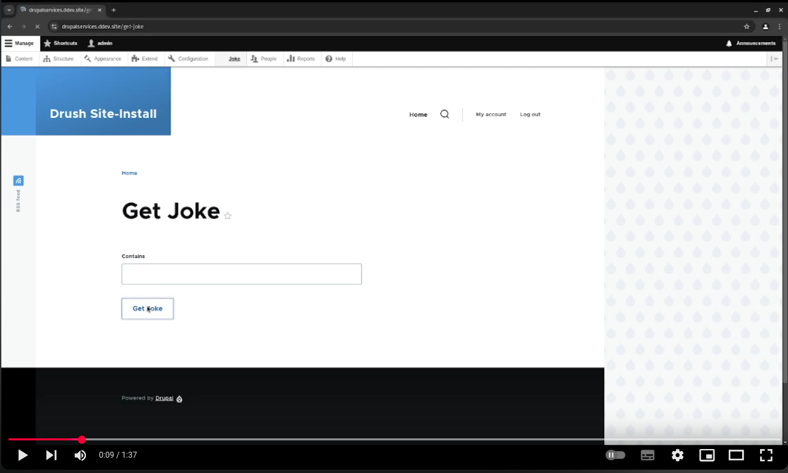

# An Introduction To Drupal Services
<p class="centre">Philip Norton<br>
<small>DrupalCamp England 2025</small></p>
<!-- Speaker notes will appear here. -->

---

# Philip Norton
- Developer at Code Enigma
- Writer at `#! code` (www.hashbangcode.com)
- NWDUG co-organiser


<!--
- Doing Drupal for about 15 years.
- Programming in general for about 20 now.
- That is a picture of a Lily58 mechanical keyboard.
-->

---
<!-- _footer: "" -->
## Source Code
- Talk is available at:
<small>https://github.com/hashbangcode/drupal-services-talk</small> or via QR code.
- All code seen can be found at
<small>[https://bit.ly/4h089yN](https://github.com/hashbangcode/drupal_services_example)</small>
- <small>[www.hashbangcode.com](https://www.hashbangcode.com)</small>


<!-- 
- Scan the QR code for the talk repo. Which has links to all of the resources you need.
-->
---

# An Introduction To Drupal Services

<!--
Drupal services are an integral part of how Drupal is structured internally. Everything from connecting to a database to decoding JSON has a service you can use to do it.

This talk will introduce you to what services are and how to use them. We'll talk about why they are used and then go onto building our own services.

This talk will assume you have some understanding of PHP and OOP, but if you get lost then please ask me to talk you throught stuff afterwards.
-->
---

# Why Talk About Services?

<!--
- I gave a version of this talk at DrupalCamp London in 2018.
- A bit has changed since then so I thought it was time to an update.
- They are an essential part of Drupal.
- If you are going to build or maintain a module then you will use services.
- I quite like back to basics talks.
- Coming soon are service hooks. We will soon lose some hooks and need to use service based hooks instead.
-->

---

## What Is A Service?

- Used in all parts of Drupal and many modules.

* Built on the <strong>Symfony Service Container</strong> system.

* A service describes an object in Drupal.

* <strong>Dependency injection</strong> is used to inject services into other services.

* Services make unit testing much easier.

* Simple to use and powerful.

---

# Using A Service

---

## Using A Service

- Services can be accessed via the Drupal object.

```php
$serviceObject = \Drupal::service('thing');
```

---
## Using A Service

- To use a service, pick the service you need.
- Use it.

```php
$pathManager = \Drupal::service('path_alias.manager');
$normalPath = $pathManager->getPathByAlias('somepath');
```
<!--
This is the path alias manger service. The above code will convert
"somepath" into a Drupal path, something like "node/123".
-->
---

## Using A Service
- You can also chain the call.

```php
$normalPath = \Drupal::service('path_alias.manager')->getPathByAlias('somepath');
```

---

# What Services Exist?

---

## What Services Exist?

- There are lots!

```bash
drush eval "print_r(\Drupal::getContainer()->getServiceIds());"
```

- Prints a list of over 600 services in Drupal core.
- Most are in the form `date.formatter`.
- Some are in the form `Drupal\Core\Datetime\DateFormatterInterface`, and are used in autoloading.

---

## Using A Service

- Most of the time you don't want to be using `\Drupal::service()`.
* Unless you are running code in a hook you should be injecting services into your own code.
* Drupal will handle what services are needed to create your needed service.
* This is called <strong>dependency injection</strong>.

---

# Dependency Injection

A quick introduction.

---

## Dependency Injection

Dependecy injection sounds complicated, but its just the practice of <strong>injecting the things the object needs</strong>, instead of <strong>baking them into the class</strong>.

---

## Dependency Injection

- Let's say you had this class (not a Drupal thing).

```php
class Page {
  protected $database;
  public function __construct($dbname, $username, $password) {
    $this->database = new PDO('mysql:host=localhost;dbname='. $dbname, $username, $password);
  }
}
$page = new Page('test', 'username', 'password');
```

- What happens if you want to change the credentials? Or change the database itself?
- You would need to edit the class or the creation code.
<!--
Think SOLID principles.
-->

---

## Dependency Injection

- We can change this to inject the database dependency as we create the Page object.

```php
class Page {
  protected $database;
  public function __construct(DbConnectionInterface $database) {
    $this->database = $database;
  }
}
$database = new MysqlDatabase($dbname, $username, $password);
$page = new Page($database);
```
<!--
Dependency Inversion principle.
-->

---

# Creating Your Own Services

---

## Creating Services

- Custom services are defined in a `[module].services.yml` file in your module directory.

```yml
services:
  services_simple_example.simple_service:
    class: \Drupal\services_simple_example\SimpleService
```
---

## Creating Services

- Create the class for your service.

```php
<?php

namespace Drupal\services_simple_example;

class SimpleService implements SimpleServiceInterface {

  public function getArray():array {
    return [];
  }
}
```

---

## Creating Services

- You can now use your service like any Drupal service.

```php
$simpleService = \Drupal::service('services_simple_example.simple_service');
$array = $simpleService->getArray();
```

---

## Creating Services - Arguments

- Most commonly, we want to inject our service dependencies.

```yml
services:
  services_argument_example.single_argument:
    class: \Drupal\services_argument_example\SingleArgument
    arguments: ['@password_generator']
```
<!--
We are injecting the service to generate passwords.
-->
---

## Creating Services - Arguments

- Your services can accept a number of arguments.

  - `@` for another service (`@password_generator`).
  - `%` for a parameter (`%site.path%`).
  - 'config' = A string, in this case ‘config’.

<!--
Parameters are set in services files, but can be overridden at runtime by Drupal.
Strings are used to pass static properties to factories to generate different types of object.
-->

---

## Creating Services - Arguments

- Our service class needs to accept the arguments in the constructor.

```php
<?php

namespace Drupal\services_argument_example;

use Drupal\Core\Password\PasswordGeneratorInterface;

class SingleArgument implements SingleArgumentInterface {

  public function __construct(protected PasswordGeneratorInterface $passwordGenerator) {
  }
}
```
<!--
This is call constructor property promotion. The $passwordGenerator property is created in our class.
Requiring the interface follows SOLID principles, in this case the dependency inversion principle.
-->

---

## Creating Services - Arguments

- The service can be used within the class.

```php
class SingleArgument implements SingleArgumentInterface {

  public function __construct(protected PasswordGeneratorInterface $passwordGenerator) {
  }

  public function generate12CharacterPassword():string {
    return $this->passwordGenerator->generate(12);
  }
}
```
---

## Creating Services - Arguments

- You can now use your service.

```php
$singleArgument = \Drupal::service('services_argument_example.single_argument');
$password = $singleArgument->generate12CharacterPassword();
```

---

## Creating Services - Autowiring

- You don't need to add all of your dependencies by hand, you can use autowiring to do this for you.
- Autowiring works by nominating services that correspond to interfaces.

```yml
services:
  Drupal\Core\Password\PasswordGeneratorInterface: '@password_generator'
```
<!--
This is from the Drupal core.services.yml file, where a lot of services are defined.
-->
---

## Creating Services - Autowiring

- Then, we need to add the `autowire: true` directive to the service definition for our service.

```yml
services:
  services_autowire_example.autowire_example:
    class: \Drupal\services_autowire_example\AutowireExample
    autowire: true
```

---

## Creating Services - Autowiring

- Alternatively, you can set a default in your service file that all services will be autowired.

```yml
services:
  _defaults:
    autowire: true

  services_autowire_example.autowire_example:
    class: \Drupal\services_autowire_example\AutowireExample
```

---
<!-- _footer: "" -->
## Creating Services - Autowiring

- Create your class as normal. The interfaces you nominate will be translated into services and automatically injected into your constructor.

```php
namespace Drupal\services_autowire_example;

use Drupal\Core\Password\PasswordGeneratorInterface;

class AutowireExample implements AutowireExampleInterface {

  public function __construct(protected PasswordGeneratorInterface $passwordGenerator) {
  }

  public function generate12CharacterPassword():string {
    return $this->passwordGenerator->generate(12);
  }
}
```

---

# Controllers And Forms

---
<!-- _footer: "" -->
## Controllers And Forms

- Some types of Drupal object (especially Controllers and Forms) don't use `*.services.yml` files.
- Instead they implement 
```
\Drupal\Core\DependencyInjection\ContainerInjectionInterface
```
* Drupal will see this and use a method called `create()` in the class to create the service.
* The `create()` method must return an instance of the service object.  

---
<!-- _footer: "" -->
## Controllers And Forms

- Best practice is to assign the properties you need in the `create()` method.

```php
class ControllerExample extends ControllerBase {

  protected $passwordGenerator;

  public static function create(ContainerInterface $container) {
    $instance = new static();
    $instance->passwordGenerator = $container->get('password_generator');
    return $instance;
  }

  /// .. 
}
```
<!--
The static() here is a reference to the current class. This calls the constructor but you probably don't need to define the controller.
-->
---
## Plugins

- Plugins have a similar interface called
```
\Drupal\Core\Plugin\ContainerFactoryPluginInterface
```
- This has the same `create()` method system, although you need to pass the plugin arguments to the parent constructor.

<!--
Plugins work in the same way, but plugins will have additional arguments that need to be passed upstream. 
-->
---

## Plugins

- The plugin constructor does need to receive arguments for plugins.

```php
  public static function create(ContainerInterface $container, 
    array $configuration,
    $plugin_id,
    $plugin_definition
  ) {  
    $instance = new static($configuration, $plugin_id, $plugin_definition);
    $instance->passwordGenerator = $container->get('password_generator');
    return $instance;
  }
```

<!--
This technique comes in useful when making blocks, creating views plugsin, migration plugins and so on.
-->

---

# Hook Service Classes

---

## Hook Service Classes

- New in Drupal 11.1.0!
- Procedural hooks are being replaced by an OOP approach.
- Built using services.
- Not all hooks are being replaced. For example:
  - `hook_install()` `hook_update_N()`
  - `hook_preprocess_HOOK()`
- See https://www.drupal.org/node/3442349

<!--
This isn't a rug pull. All your normal hooks will work for the time being (we'll come onto that).
-->

---

## Hook Service Classes

- Define the service to put our hooks in.

```yml
services:
  services_hooks_example.node_hooks:
    class: \Drupal\services_hooks_example\Hook\NodeHooks
    autowire: true
```

---
<!-- _footer: "" -->
## Hook Service Classes

- Define our hooks using PHP attributes.

```php
namespace Drupal\services_hooks_example\Hook;

use Drupal\Core\Hook\Attribute\Hook;
use Drupal\node\NodeInterface;

class NodeHooks {
  /**
   * Implements hook_ENTITY_TYPE_insert() for node entities.
   */
  #[Hook('node_insert')]
  public function nodeInsert(NodeInterface $node) {
    // Act on the hook being triggered.
  }
}
```
--- 

## Hook Service Classes

- For the time being, you are encouraged to add a shim procedural hook in the usual place.

```php
use Drupal\node\NodeInterface;

#[LegacyHook]
function mymodule_node_insert(NodeInterface $node) {
  \Drupal::service('services_hooks_example.node_hooks')->nodeInsert($node);
}
```
<!--
There doesn't appear to be any word on deprications of procedural hooks.
In fact many theme and install hooks will remain.
The aim is to allow low level hooks that have no dependencies to operate as they always have.
-->
---

## Hook Service Classes

- If you have no legacy hooks then you can improve performance by setting this parameter in your *.services.yml file.

```yml
parameters:
  module_name.hooks_converted: true
```

---

# Tagged Services

---

## Tagged Services

- Some services can be tagged.
- This gives them special abilities.
- Listening to events, controlling access, set up caching, etc. 

---

## Tagged Services - Events

- The simplest tagged service is the event subscriber.
- This service will be triggered when events happen.

```yml
services:
  eventsubscriber_example.eventlistner_service:
    class: \Drupal\eventsubscriber_example\EventSubscriber\EventListenerService
    tags:
      - { name: event_subscriber }
```

---
<!-- _footer: "" -->

## Tagged Services - Events

```php
namespace Drupal\eventsubscriber_example\EventSubscriber;

use Symfony\Component\EventDispatcher\EventSubscriberInterface;
use Symfony\Component\HttpKernel\Event\RequestEvent;
use Symfony\Component\HttpKernel\KernelEvents;

class EventListenerService implements EventSubscriberInterface {

  public function onRequest(RequestEvent $event) {
    // Runs when a request is made.
  }

  public static function getSubscribedEvents(): array {
    return [KernelEvents::REQUEST => [['onRequest', 1]]];
  }
}
```

---
<!-- _footer: "" -->
## Tagged Services - Autoconfigure

- Use the `autoconfigure: true` directive to automatically tag classes. 

```yml
services:
  _defaults:
    autoconfigure: true
  services_autoconfigure_example.autoconfigured_service:
    class: \Drupal\services_autoconfigure_example\EventSubscriber\AutoconfiguredService
```
- For events, Drupal looks for services that extend <p class="small-text">\Symfony\Component\EventDispatcher\EventSubscriberInterface</p>

---

# Tips For Creating Services

---

<!-- _footer: "" -->
## Tips For Creating Services

- Don't use `\Drupal::service()` inside your service classes, use dependency injection instead.
* Use <strong>SOLID</strong> principles. Create small service classes that perform one task.
* Don't have services with lots of arguments. This tends to show that the service is doing too much.
* Keep constructors as simple as possible. Just assign your dependencies to properties.
 
---
## Tips For Creating Services

- Don't "hand off" dependencies to internal classes, use additional services.
* Consider not creating a service if the class has no dependencies.
* If you need to alter the class at runtime then make a service to allow Drupal to do that.

---

# Altering Services

---

## Altering Services

- All services can be modified to change their funcitonality.
- This can be done in two ways, depending on your needs:
  - Decorating
  - Altering

---

## Altering Services: Decorating

- Services can be decorated to create your own service that extends another service.
- The original service will still exist, but you will have a new service that accepts the same arguments.

```yml
services:
  services_decorator_example.decorated_password_generator:
    class: \Drupal\services_decorator_example\DecoratedPasswordGenerator
    decorates: password_generator
```
<!--
Here, we are decorating the password_generator and creating our own service called services_decorator_example.decorated_password_generator.
The critical thing is that the existing service class still exists. The new service just extends that.
-->

---
<!-- _footer: "" -->
## Altering Services: Decorating

- We just extend the original class.

```php
<?php

namespace Drupal\services_decorator_example;

use Drupal\Core\Password\DefaultPasswordGenerator;

/**
 * Decorates the DefaultPasswordGenerator class.
 */
class DecoratedPasswordGenerator extends DefaultPasswordGenerator {

  protected $allowedChars = 'abcdefghijkmnopqrstuvwxyz';

}

```

---
<!-- _footer: "" -->
## Altering Services: Altering

- Override the serivce completely and replace it with your own.
* Create a class that has the name `[ModuleName]ServiceProvider`, which extends the class <p class="small-text">\Drupal\Core\DependencyInjection\ServiceProviderBase</p>
* Drupal will pick up this class and run the `register()` and `alter()` methods.

<!-- 
Use register() to register a new service in Drupal. Useful for highly dynamic services where you want to automatically create your services at run time.

Use alter() to alter the service registry and change any registered service in the site.
-->
---

## Altering Services: Altering

- Altering services is especially powerful when integrating with an external API.
* You can stub or mock the external API so that you can run tests using a known subset of data.
* Also useful if you API restricted and not everyone has access to it.

---

## Altering Services: Altering

- The Joke API (https://sv443.net/jokeapi/v2/) is a free API that returns Jokes.
- Joke API service wraps the API so we can call it.

```yml
services:
  joke_api.joke:
    class: Drupal\joke_api\JokeApi
    autowire: true
```
---
<!-- _footer: "" -->

## Altering Services: Altering

- The `joke_api.joke` service calls the API and returns a joke.

 ```php
namespace Drupal\joke_api;

use GuzzleHttp\Client;

class JokeApi implements JokeApiInterface {

  protected $url = 'https://v2.jokeapi.dev/joke/';

  public function __construct(protected ClientInterface $httpClient) {}

  public function getJoke() {
    $request = $this->httpClient->request('GET', $url);
    return json_decode($request->getBody()->getContents());
  }
}
```

---

## Altering Services: Altering

- To alter this service we need to create a module called joke_api_stub.
- We then add a class called `JokeApiStubServiceProvider` that extends `ServiceProviderBase`.

---

<!-- _footer: "" -->
## Altering Services: Altering

- The `alter()` method is can be used to alter an existing service.

```php
namespace Drupal\joke_api_stub;

use Drupal\Core\DependencyInjection\ContainerBuilder;
use Drupal\Core\DependencyInjection\ServiceProviderBase;

class JokeApiStubServiceProvider extends ServiceProviderBase {
  public function alter(ContainerBuilder $container) {
    // Replace the \Drupal\joke_api\JokeApi class with our own stub class.
    $definition = $container->getDefinition('joke_api.joke');
    $definition->setClass('Drupal\joke_api_stub\JokeApiStub');
  }
}
```
<!--
Here, we are altering the joke_api.joke service to replace it with our a stub service that doesn't integrate with the Joke API.
-->

---
<!-- _footer: "" -->

## Altering Services: Altering

```php
namespace Drupal\joke_api_stub;

use Drupal\joke_api\JokeApi;

class JokeApiStub extends JokeApi {

  public function getJoke() {
    $data = '{
    "error": false,
    "category": "Programming",
    "type": "twopart",
    "setup": "A web developer walks into a restaurant.",
    "delivery": "He immediately leaves in disgust as the restaurant was laid out in tables.",
    "flags": {
        "nsfw": false,
        "religious": false,
        "political": false,
        "racist": false,
        "sexist": false,
        "explicit": false
    },
    "id": 6,
    "safe": true,
    "lang": "en"
    }';
    return json_decode($data);
  }
}
```

---
<!-- _footer: "" -->

<a href="https://www.youtube.com/watch?v=Iisa-3LYsvk" target="_blank">]</a>


---

# Next Steps

There's much more to Drupal services, try looking up

- Access control services
- Factories
- Lazy services
- Public and private services
- Service aliases
---
<!-- _footer: "" -->
## Resources

- Services and DI on `#! code` <small>[www.hashbangcode.com/tag/dependency-injection](https://www.hashbangcode.com/tag/dependency-injection)</small>
- Custom code seen is code available at <small>https://github.com/hashbangcode/drupal_services_example</small>
- Joke API available at <small>https://github.com/hashbangcode/joke_api</small>
<!--
- These links are on the repo page for the talk. https://github.com/hashbangcode/drupal-services-talk.
-->
---
## Resources
- Services and Dependency Injection - <small>https://www.drupalatyourfingertips.com/services</small>
- Structure of a service file https://bit.ly/4hOh1ZT

---

## Questions?

- Slides: https://github.com/hashbangcode/drupal-services-talk


---

## Thanks!

- Slides: https://github.com/hashbangcode/drupal-services-talk


